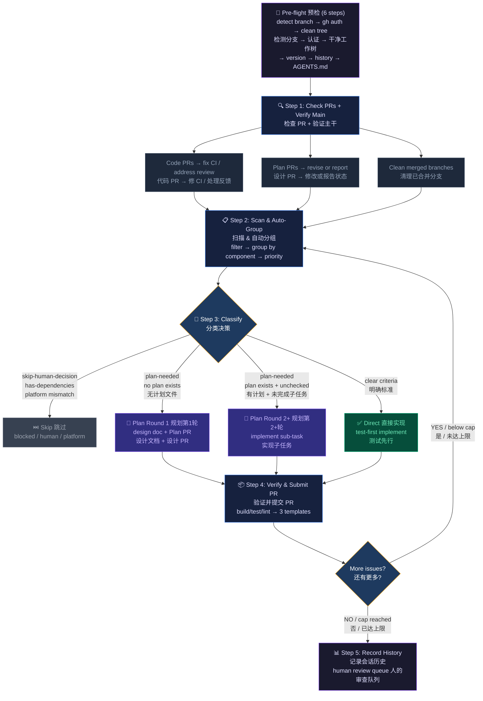

<div align="center">

# 🔄 Loop Kit

**Structured Issue Processing Toolkit for AI Coding Agents**

**面向 AI 编程智能体的结构化 Issue 处理工具包**

[](LICENSE)
[](https://github.com/Gzbox/loop-kit/releases)
[](https://github.com/Gzbox/loop-kit/issues)
[](https://github.com/Gzbox/loop-kit/pulls)

[English](#-overview) · [中文](#-概述) · [📖 Guide / 使用教程](docs/guide.md)

---

*Turn your GitHub Issues into a disciplined development loop.*

*将你的 GitHub Issues 变为一套有纪律的开发闭环。*

</div>

<br/>

## 📖 Overview

Loop Kit is a **reusable, language-agnostic** toolkit that transforms GitHub Issues into a structured, repeatable workflow for AI coding agents. No matter your tech stack, Loop Kit gives your agent a disciplined loop:

**Check PRs → [Auto-Group → Select Issue → Implement → Submit PR] × N → Review Checklist**

## 📖 概述

Loop Kit 是一个**可复用、语言无关**的工具包，它将 GitHub Issues 转化为面向 AI 编程智能体的结构化、可重复工作流。不论你的技术栈如何，Loop Kit 都能为你的智能体提供一套有纪律的闭环：

**检查 PR → [自动分组 → 选取 Issue → 实现 → 提交 PR] × N → Review 清单**

<br/>

## 🚀 Quick Start / 快速开始

### Install / 安装

```bash
bash <(curl -sL https://raw.githubusercontent.com/Gzbox/loop-kit/main/install.sh)
```

### First-time Setup / 首次配置

```
git add . && git commit -m 'chore: add Loop Kit' && git push
/loop-init          ← AI analyzes your project, generates AGENTS.md + labels
```

### Start Working / 开始工作

```
/loop               ← Process all issues (grouped, review-friendly PRs)
/loop-issue #5      ← Process a specific issue
/loop-status        ← Quick dashboard
```

在你的 AI 编程智能体中输入以上命令即可。

<details>
<summary><b>What does this do? / 这会做什么？</b></summary>

Downloads workflows, Issue/PR templates, and auto-label action to your project.

下载工作流、Issue/PR 模板和自动标签 Action 到你的项目中。

Labels and AGENTS.md are created by `/loop-init`, not the installer.

标签和 AGENTS.md 由 `/loop-init` 创建，安装器不处理。

</details>

<br/>

## 🔄 The Loop / 处理闭环



| Phase | EN | 中文 |
|:------|:---|:-----|
| **Pre-flight** | Detect branch, verify `gh` auth, clean tree, read history, check AGENTS.md age | 检测分支、验证认证、干净工作树、读取历史、检查 AGENTS.md 时效 |
| **Step 1** | Check PRs (code + plan), verify main health, clean merged branches | 检查 PR（代码 + 设计）、验证主干健康、清理已合并分支 |
| **Step 2** | Scan issues, filter (deps/skip/PR), auto-group, order by priority | 扫描 Issue、过滤、自动分组、按优先级排序 |
| **Step 3** | Classify: **Skip** · **Plan Round 1** (design doc) · **Plan Round 2+** (sub-task) · **Direct** (test-first) | 分类：跳过 / 规划第1轮 / 规划第2+轮 / 直接实现 |
| **Step 4** | Verify (build/test/lint), submit PR (3 templates), group finalize, loop back | 验证、提交 PR（3套模板）、分组收尾、循环 |
| **Step 5** | Record session history + human review queue | 记录会话历史 + 人的审查队列 |

<br/>

## 📁 Project Structure / 项目结构

```
loop-kit/
├── workflows/
│   ├── loop.md                # /loop — batch issue processing with grouping
│   ├── loop-issue.md              # /loop-issue — process a specific issue
│   ├── loop-status.md             # /loop-status — grouped dashboard
│   └── loop-init.md               # /loop-init — auto-generate AGENTS.md + labels
├── templates/
│   └── github/
│       ├── ISSUE_TEMPLATE/
│       │   ├── bug_report.yml
│       │   ├── feature_request.yml
│       │   └── config.yml
│       ├── PULL_REQUEST_TEMPLATE.md
│       └── workflows/
│           └── auto-label-issues.yml
├── docs/
│   └── guide.md                   # Usage tutorial (EN/中文)
├── install.sh                     # One-command installer
└── README.md
```

<br/>

## ✨ Features / 特性

| | Feature / 特性 | Description / 描述 |
|:--|:--------------|:-------------------|
| 🔄 | **Auto-Group & Batch** / 自动分组批处理 | Groups related issues by component, processes all in one session / 自动分组相关 Issue，一次批量处理 |
| 🎯 | **Review-Friendly PRs** / 易读 PR | Key review points, group info, merge order in every PR / 每个 PR 含重点行、分组信息、合并顺序 |
| 📋 | **Review Checklist** / 审查清单 | Session summary = human's grouped to-do list / 会话摘要 = 人的分组待办清单 |
| 🔁 | **Feedback Loop** / 反馈闭环 | Reads review comments, fixes code, pushes updates / 读 review 评论，修代码，推送更新 |
| 🏥 | **Main Health** / 主干守护 | Verifies tests pass on main before starting new work / 开始新工作前验证主干健康 |
| 🚀 | **Zero-Config Init** / 零配置初始化 | `/loop-init` auto-generates AGENTS.md + labels / `/loop-init` 自动生成 AGENTS.md + 标签 |
| 📊 | **Grouped Dashboard** / 分组仪表盘 | `/loop-status` shows PRs grouped by component / 按组件分组展示 PR |
| 🧠 | **Smart Classification** / 智能分类 | Skip / Plan / Direct decision tree / 跳过 / 规划 / 直接实现的决策树 |
| 🖥️ | **Platform Aware** / 平台感知 | Skips issues requiring unavailable platforms / 跳过需要不可用平台的 Issue |
| 🔗 | **Dependency Tracking** / 依赖追踪 | Structured `Depends On` field — auto-skips blocked issues / 结构化依赖声明 — 自动跳过被阻塞的 Issue |
| 🔧 | **Flexible** / 灵活适配 | Works with any language, any stack / 适用于任何语言、任何技术栈 |
| 🔄 | **Plan Review Lifecycle** / 方案审核生命周期 | Plan PR review-revise-approve cycle with GitHub native review states / 使用 GitHub 原生审核状态的方案审核循环 |
| 🔀 | **Dynamic Branch Detection** / 动态分支检测 | Works with any default branch name (main, master, develop...) / 支持任何默认分支名 |

<br/>

## 🎛️ Flexibility / 灵活性

Loop Kit adapts intelligently to your project setup:

Loop Kit 会智能适配你的项目配置：

| Scenario / 场景 | Behavior / 行为 |
|:----------------|:----------------|
| No priority labels / 无优先级标签 | Agent reads issue bodies and assesses priority / 智能体读取 Issue 正文自行评估优先级 |
| No test framework / 无测试框架 | Implements directly, notes gaps in PR / 直接实现，在 PR 中声明未测试项 |
| No `AGENTS.md` / 无 `AGENTS.md` | Uses sensible defaults / 使用合理的默认值 |
| Trivial fix / 简单修复 | Skips classification, just fixes and PRs / 跳过分类，直接修复并提 PR |
| Blocked issue / 被阻塞的 Issue | Skips it, picks the next one / 跳过当前，选取下一个 |
| Platform mismatch / 平台不匹配 | Skips issues requiring unavailable platform / 跳过需要不可用平台的 Issue |
| Branch protection / 分支保护 | Auto-fallback to chore branch for history commits / 自动回退到 chore 分支提交历史记录 |
| Fork workflow / Fork 工作流 | Use `--repo` flag to target upstream for PRs / 使用 `--repo` 参数将 PR 指向上游 |

<br/>

## 📋 Prerequisites / 前置条件

| Requirement / 依赖 | Description / 说明 |
|:-------------------|:-------------------|
| [`gh` CLI](https://cli.github.com/) | Authenticated with repo access / 已认证且有仓库访问权限 |
| AI Coding Agent | Supports `/workflow` commands (e.g., Antigravity, Claude Code) / 支持 `/workflow` 命令的 AI 编程智能体 |

<br/>

## 📖 Documentation / 文档

For a complete step-by-step tutorial, see the **[Usage Guide](docs/guide.md)**.

完整的逐步使用教程，请参阅 **[使用指南](docs/guide.md)**。

<br/>

## 📄 License / 许可证

This project is licensed under the [MIT License](LICENSE).

本项目基于 [MIT 许可证](LICENSE) 开源。

---

<div align="center">
<sub>Built with ❤️ by <a href="https://github.com/Gzbox">Gzbox</a></sub>
</div>
